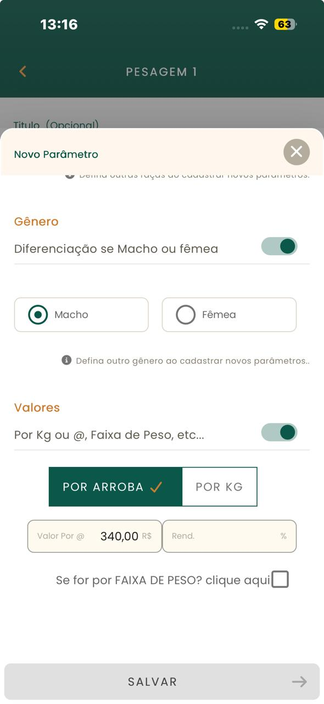
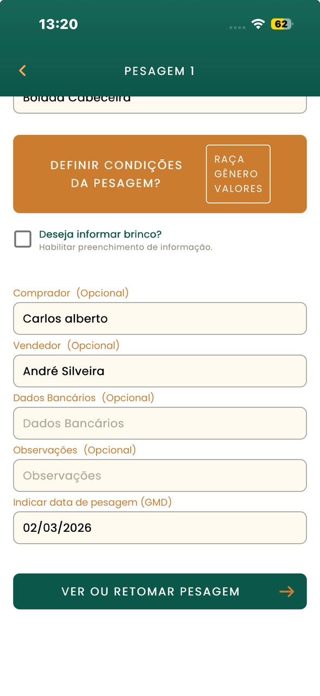
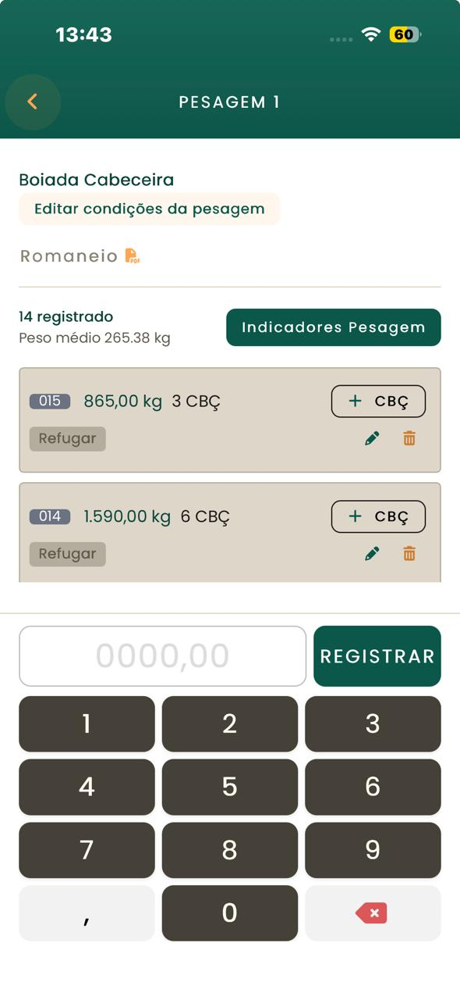

# Calculadora GMD

## Sobre o projeto

Aplicativo mobile desenvolvido para auxiliar no controle de pesagem de gado, permitindo o cálculo de GMD, além de registrar informações importantes como peso, quantidade e valores.

Funciona offline

## Funcionalidades

- Registros
  - Registro de pesagem
  - Registro de gênero
  - Peso em kg ou arroba
  - Quantidade de animais
  - Data da pesagem
  - Informação do comprador

- Cálculos 
  - Ganho Médio Diário (GMD)
  - Peso médio diário
  - Valor total

- Funcionamento
  - Funcionamento offline
  - Funcionamento com SQLite    

## Demonstração em prints

## Stacks

- Java
- SQLite 
- Android SDK